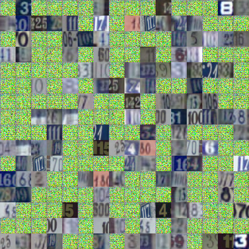

# Generative Adversarial Network written in TensorFlow

This is a Generative Adversarial Network[[1]](https://arxiv.org/abs/1406.2661) written in TensorFlow

The model is trained on the dateset SVHN

to run the code, put the file `train_32x32.mat` (with SVHN) in the dir `data/SVHN`

then run 
```
python2.7 main.py
```
the images generated will be put in directory `gen/`

The following iamges were generated by our model, first one is generated and the second one is mixing generated images with source data (the 400th batch)

##### Epoch 0



##### Epoch 65


##### Epoch 457


##### Epoch 795


---
### Deficency of my apporach

* The result is not stable. For example, in the 547th generation, we get a terriable image as follows


* Sometimes, the two neighboring generations will have nearly no difference, this may due to being the local optimal. 
* On the other hand, some output of neighboring generations are very different, that maybe caused by the large stdarand deviation(10.0) of the input noise of the generator.
* The SVHN dataset's distribution has a relatively large deviation, so it is hard for our network to learn it.
* May exists overfitting, no idea what it will cause or how to avoid it


----
### Update on Aug 12th, 2017:

Rewrite the model follow WC-GAN[[2]](https://arxiv.org/pdf/1511.06434.pdf), which was developed by 
Alec Radford etc.

All code before were moved to the directory "ignore", please ignore them because they are just something of a mess.


----
### Reference

[[1] Generative Adversial Nets, Ian J. Goodfellow etc., _arxiv 1406.2661_](https://arxiv.org/abs/1406.2661)

[[2] Unsupervised Representation Learning With Deep Convolution Generative Adeversial Networks, Alec Radford etc., _ICLR 2016_ ](https://arxiv.org/pdf/1511.06434.pdf)